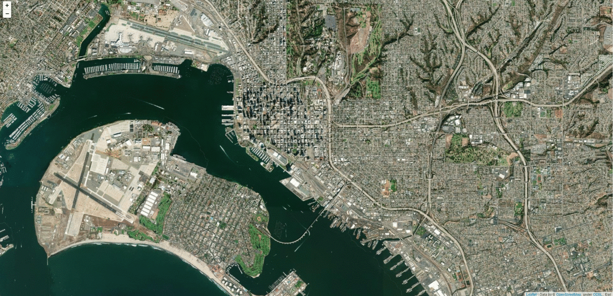
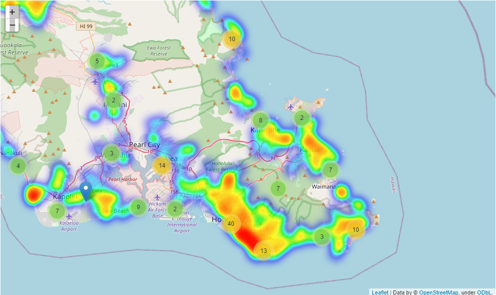
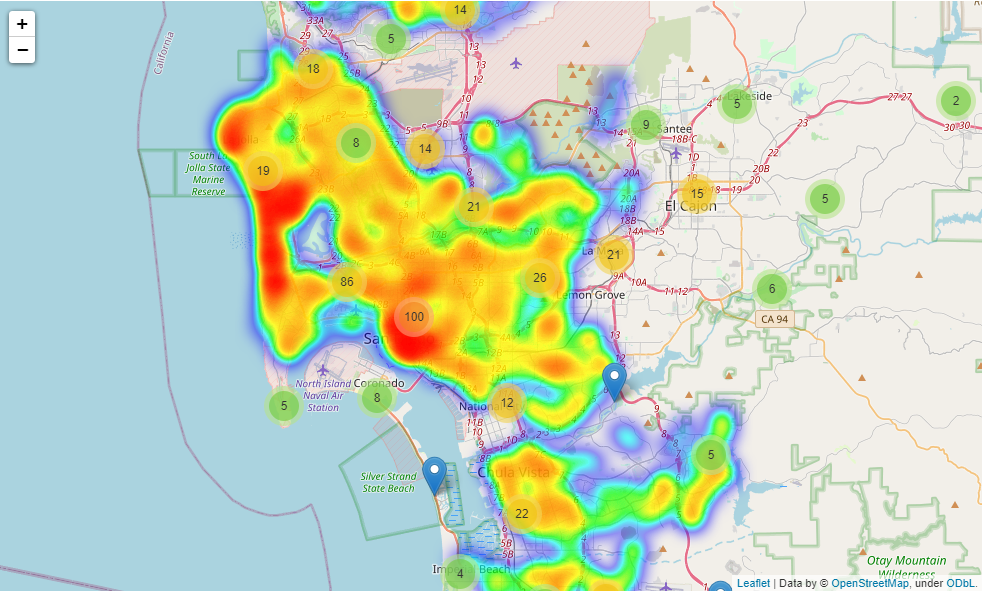

# SIADS697-JNH
This is the github repository for Julia Wu, Nick Martin, and Hyungmook Oh for their SIADS Capstone Project

# To Host or Not to Host: An Exploration within the code behind the Capstone Airbnb blog post
The notebooks created within this project illustrates the process that lead to our Airbnb results. Two major areas, Hawaii and San Diego, are chosen due to their tourist heavy locations. There are two folders that have mirroring code to represent huge similarity in the results that lead to our definition of "success." This readme is to guide the reader through our notebooks, and navigate to files that are most significant to our analysis.

## Before running the notebooks
Please make sure everything from requirements.txt is installed.

## Important Folders and Files
### Hawaii
Contains datasets from both airbnb and poi factory for Hawaii. The csv files are in their respective folders for ease of access. The csv files outside of these folders are utilized specifically for the notebook code, as some are used specifically for certain scenarios.
* airbnb:
Csv datasets from InsideAirbnb. Includes a Power-bi dashboard "Hawaii_dashboard" that visualized basic components of our datasets for initial analysis.
* poi_factory:
Csv datasets from poi-factory. Represents local attractions based on point of interest.
* Folium_with_Hawaii.ipynb:
Displays interactive heatmap of Hawaii that includes clusters of close attractions. Defines what was done to manipulate the dataset and create the visuals.
* kepler_heatmap.gl:
Illustrates the interactive heatmap in a more dynamic 3D map. 
* Basic_models_with_hawaii.ipynb:
Establishes basic models within our Hawaii dataset. Allows us to generalize initial thoughts on what defined "success."

### San_Diego
Contains datasets from both airbnb and poi factory for San Diego. The csv files are in their respective folders for ease of access. The csv files outside of these folders are utilized specifically for the notebook code, as some are used specifically for certain scenarios.
* airbnb:
Csv datasets from InsideAirbnb. Includes a Power-bi dashboard "San_Diego_dashboard" that visualized basic components of our datasets for initial analysis.
* poi_factory:
Csv datasets from poi-factory. Represents local attractions based on point of interest.
* Folium_with_San_Diego.ipynb:
Displays interactive heatmap of San Diego that includes clusters of close attractions. Defines what was done to manipulate the dataset and create the visuals.
* Basic_models_with_san_diego.ipynb:
Establishes basic models within our San Diego dataset. Allows us to generalize initial thoughts on what defined "success."

# RoadMap
While this is specifically for the capstone final project, there are some potential ideas to continue this research. However, all further plans are put into a hold, and any code from here on will be through personal goals.

# Contributing
Only shuyue@umich.edu, hyusteoh@umich.edu, and nkmartin@umich.edu are able to make changes to this project. Please email us if you would like to make pull requests or need specific information.

# Authors and acknowledgement
Congratulations to Julia Wu, Nick Martin, and Hyungmook Oh for completing this project! Thanks to the SIADS 697 team for making this possible. Special thanks to Dr. Elle O'Brien for bi-weekly encouragement and support!

# Project Status
Completed, no further development is planned as of 8/21/2021